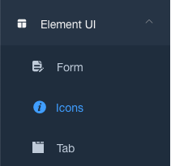

# Create New Page

This document describes how to create a new page in laravue. If you are familiar with the `vue-router` then it will be very simple.

## Add the route

Firstly, we have to add the route to the `@/router/index.js`. For example:

**add a `foo` page**

The below code will create a blank route based on `Layout`

```js
{
  path: '/foo',
  component: Layout,
  redirect: '/foo/index',
  name: 'foo',
  meta: {
    title: 'foo',
    icon: 'star',
  },
}
```

::: tip Icon
Laravue offers 2 icon set (IconFont and ElementUI). You can see all icons [here](https://laravue.dev/#/element-ui/icons), and document [here](/guide/advanced/icon.md)
:::

Next, you have to add a route to the 'children' below it:

```js
{
  path: '/foo',
  component: Layout,
  redirect: '/foo/index',
  meta: {
    title: 'foo', // This title will show on the breadcrumb before submenu's title
    icon: 'star', // Use star icon
  },
  children: [
    {
      path: 'index', // When clicking on this menu, it will redirect to /#/foo/index
      name: 'foo',
      meta: { title: 'foo' }, // Show `foo` on the sidebar
    },
  ],
}
```

**The sidebar will show `foo` menu like this**


Clicking on this menu will redirect to `/#/foo/index`, and blank page will show (since we haven't imported the view). And there is no icon or the submenu because no icon declared.
<br/>

:::tip
Since `children` only declares one route below, there will be no expansion arrow. If the number of routes under `children` is greater than 1, there will be an expansion arrow, as shown below.

If you want to ignore this behaviour, you can use `alwaysShow: true`, so that it will ignore the previously defined rule and display the root route. See the [Router and Nav](/guide/essentials/router-and-nav.md) for details.

:::

```js
{
  path: '/foo',
  component: Layout,
  redirect: '/foo/index',
  name: 'foo',
  meta: {
    title: 'foo',
    icon: 'star', // Using SVG icon
  },
  children: [
    {
      path: 'index', // When clicking this submenu, it will redirect to /#/foo/index
      name: 'foo',
      meta: { title: 'foo' }, // foo submenu
    },
    {
      path: 'bar', // When clicking this submenu, it will redirect to /#/foo/bar
      name: 'bar',
      meta: { title: 'bar' }, // bar submenu
    },
  ],
}
```


If you want to use ElementUI Icon for the menu, please use the icon class instead of svg name.

```js
  children: [
    {
      // a submenu code here
    },
    {
     path: 'icons',
     component: () => import('@/views/icons/index'),
     name: 'Icons',
     meta: {
       title: 'icons',
       icon: 'el-icon-info', // Use ElementUI icon like this
       noCache: true
       },
    },
    {
      // a submenu code here
    },
  ],
```



<br/>

## Nested Routes

If you have a nested Route, such as [@/views/nested](https://github.com/tuandm/laravue/blob/master/resources/js/views/nested),
Don't forget to manually add an `< router-view >` to the root file of the secondary directory.

For example: [@/views/nested/menu1/index.vue](https://github.com/tuandm/laravue/blob/master/resources/js/views/nested/menu1/index.vue).

**Note:** As many `<router-view>` as the level of routes nested.


<br/>

## Create View

After adding the route, we have to create a view under `@/views` folder. As usual, a router is associated with a view.

If components or utils are only used in this view, it's recommended to create a components/utils folder under this view. It is more convenient for each module to maintain its own `utils` or `components`.


Lets create a `foo` folder in `views`, with 2 view files as below:

```bash
├── app
├── resources
│   └── js
│       └── views              // views
│           └── foo
│               ├── Foo.vue    // Foo view
│               └── Bar.vue    // Bar view
```

Open `@/views/foo/Foo.vue` and add simple component like this:

```
<template>
  <div class="app-container">
    <div class="row justify-content-center">
      <div class="col-md-8">
        <div class="card card-default">
          <h3 class="card-header">Foo Component</h3>
          <div class="card-body">
            I'm a foo component.
          </div>
        </div>
      </div>
    </div>
  </div>
</template>

<script>
export default {
  mounted() {
    console.log('Foo component mounted.');
  },
};
</script>

```

Then we have to import this Foo component to route. Back to `@/router/index.js` to edit foo route

```js
{
  path: '/foo',
  component: Layout,
  redirect: '/foo/index',
  meta: {
    title: 'foo', // This title will show on the breadcrumb before submenu's title
    icon: 'star', // Use star icon
  },
  children: [
    {
      path: 'index', // When clicking on this menu, it will redirect to /#/foo/index
      component: () => import('@/views/foo/Foo.vue'),
      name: 'foo',
      meta: { title: 'foo' }, // Show `foo` on the sidebar
    },
  ],
}
```

Save and reload the page, clicking on foo menu will show Foo component.


You can try to create Bar component and import to bar submenu. Seems easy.

<br/>

## I18n

Now we have foo menu on the sidebar, but switching language doesn't change `foo` text to selected language. To add translation, we need to add translated text to `@/lang/en.js` and other lang files, such as `@/lang/vi.js`, under `router` section.

```js
// @/lang/en.js
export default {
  route: {
    ...
    foo: 'Foo',

// @/lang/vi.js
export default {
  route: {
    ...
    foo: 'Foo in VI',
```

Now switching language between EN and VI will show corresponding text.

:::tip
You can see sample code here: [How to create new page](https://github.com/tuandm/laravue/compare/guide/how-to-add-new-page?expand=1)
:::
